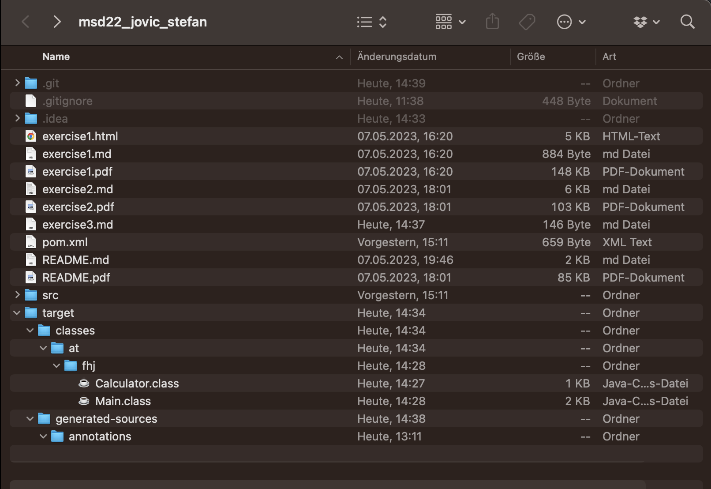
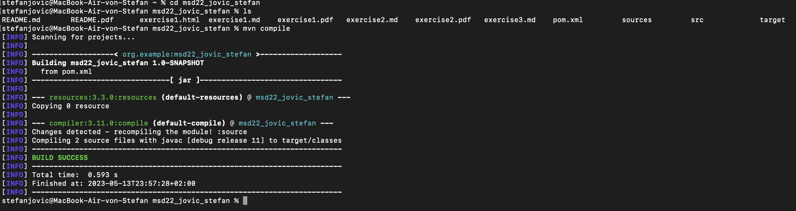

# Exercise documentation
## Stefan Jovic

### 1. New file
The added file is called "target" and includes two files called "classes" and "generated-sources"
### 2. Screenshot of the file system

*screenshot of the file system after the automatically added file*
### 3.  Screenshot of mvn compile command

*screenshot of mvn compile command*